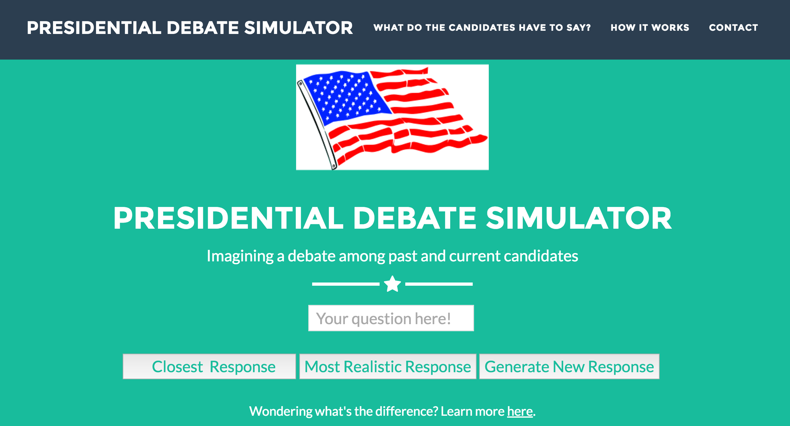
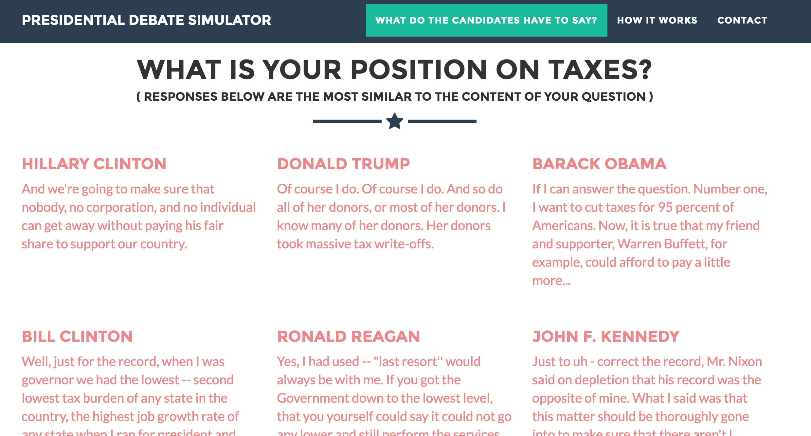
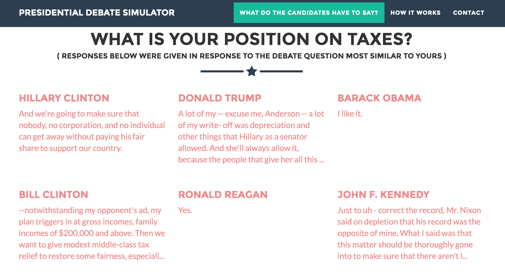
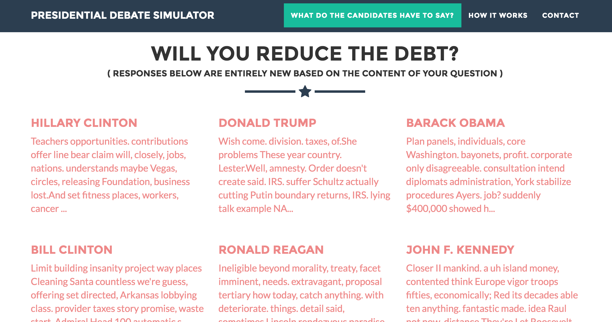
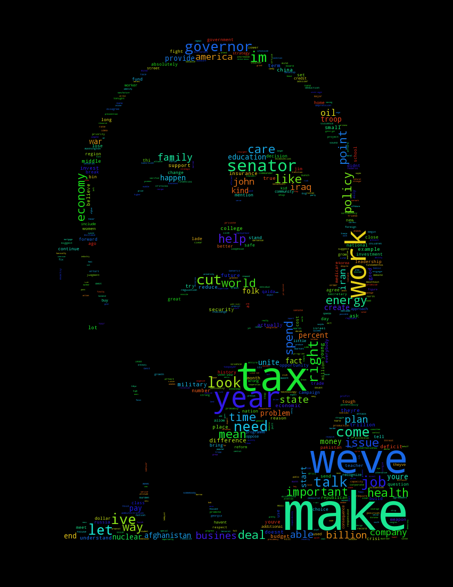

# Presidential Debate Simulator

<strong>Galvanize, Inc. 
Data Science Immersive 
Capstone Project</strong></h4>

Have you ever wondered what a presidential debate between JFK and Donald Trump would look like? Or how Bill and Hillary Clinton might bicker on stage?

Welcome to the Presidential Debate Simulator, where I use Machine Learning and Natural Language Processing (NLP) techniques to imagine what a debate among past and contemporary candidates would look like.

The final deliverable is a Flask web app where the user can ask any question and view responses from prominent presidential candidates from the past and present. Answers are returned in one of the three ways: 1) the app finds and retrieves the 'most responsive' answer (i.e., the candidate's statement that is most similar to the question); 2) the app finds and retrieves the 'most realistic' answer based not on similarity to the user's question but instead whichever response was given to the most similar debate question or verbal exchange (because we know that candidates rarely respond directly to questions); 3) the app generates a completely new answer by combining words from the candidate's vocabulary based on the question seed.

An overview of my project and workflow is available <href src NLP-and-the-Evolution-of-Presidential-Debates>here</href>.

To view the web app, clone this repo, run flask_bootstrap/app.py from the folder's root directly, and go to <i>localhost:8001</i> in your web browser.

