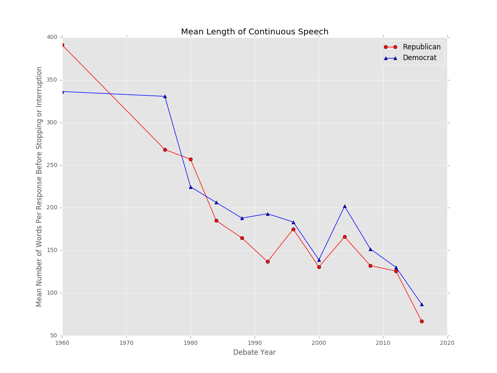
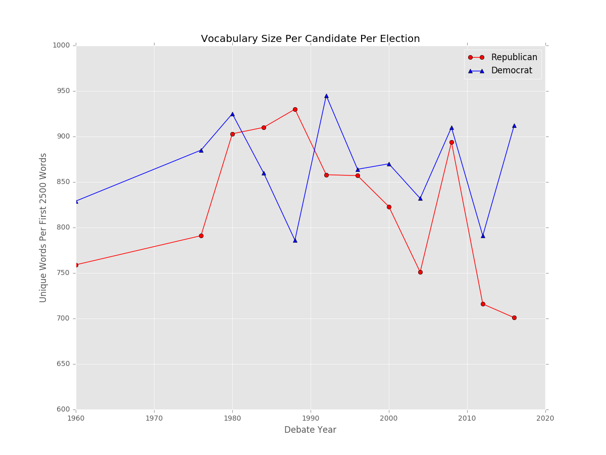

# Presidential Debate Simulator

<h4>Galvanize, Inc.</h4>
<h4>Data Science Immersive</h4>
<h4>Capstone Project</h4>

Have you ever wondered what a presidential debate between JFK and Donald Trump would look like? Or how Bill and Hillary Clinton might bicker on stage?

Welcome to the Presidential Debate Simulator, where I use Machine Learning and Natural Language Processing (NLP) techniques to imagine what a debate among past and contemporary candidates would look like.

This project is currently underway but will be complete by Nov 17, 2016. Stay tuned for updates!

